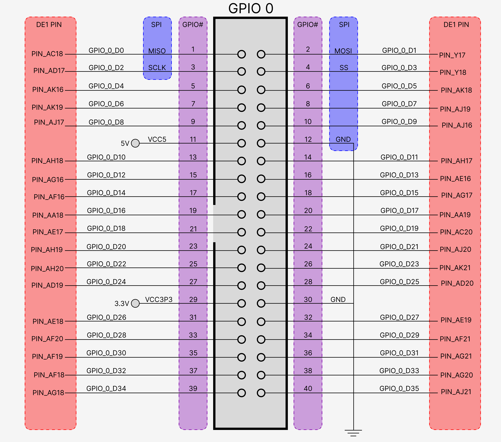
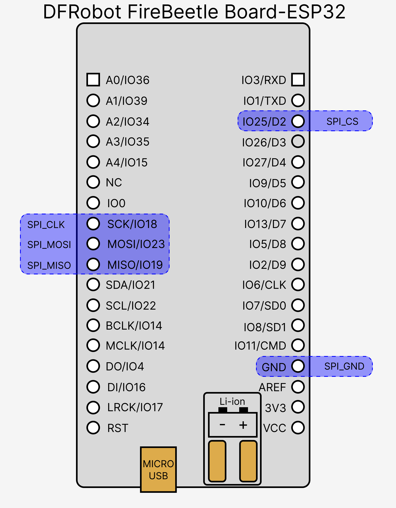

# Overview

The following dataflow diagram (DFD) describes the operating framework of the hardware accelerated pathfinder.

# Wi-Fi

The ESP32 was selected to act as an interface between the host PC and FPGA because it has a wireless network interface card. A PC and ESP32 connected to the same WLAN can communicate employing a TCP/IP socket. Byte-streams can be sent bidirectionally

## Connecting ESP32 to Host

The ESP32 must be connected to the same LAN as the host. It has not been possible to connect the ESP32 to Imperial-WPA due to WPA2 Enterprise authentication. Instead, the most practical method has been enabling host PC’s hotspot and connecting ESP32 to its LAN via normal WPA2 authentication. In future, credentials such as SSID and password will be environment variables in a separate file. Do not push credentials onto repo.

# SPI Protocol

The ESP32 communicates with the FPGA through the Serial Port Interface (SPI) protocol. SPI protocol is common for interfacing hardware components together, where one acts as a master to one or more slaves. In the chosen architecture, the ESP32 acts as master and FPGA acts as slave.

- **Clock (SCLK)**: wire which provides a common clock signal between master and slaves. The master drives this signal, which determines when TX buffers shift out data and when RX buffers sample their corresponding channel.
- **Chip Select (CS)**: A.K.A. Slave Select (SS), a signal that acts as an enable for exchanging information. Each SPI slave has a separate CS line (in the simplest topology), whilst the master drives all the CS lines.
- **Master Out, Slave In (MOSI)**: channel driven by master for serialized transmission of data to slaves. MOSI line is shared by all slaves. Only the slave with an asserted CS line should read the serialized data into its buffer.
- **Master In, Slave Out (MISO)**: channel driven by one slave at any time for serialized transmission of data to master. MISO line is shared by all slaves. Only the slave with an asserted CS line should drive this line.

The ESP32 microprocessor has fixed SPI hardware, whilst the FPGA can synthesize an SPI module in its fabric. Altera provides a ready-made SPI IP that can be added into the platform designer; the module must be connected to the NIOS2 processor and configured as a slave.

## Connecting to ESP32 to FPGA

The ESP32 can be connected to the DE1-SoC board via its GPIO pins. There are 4 pins involved in the SPI interface. Additionally, the ground pins of each device must be connected to each other, providing the same reference.

The GPIO diagram below illustrates the layout of the FPGA header pins, which are made available for external devices to connect. Each of the GPIO pins has a symbolic name, as well as a physical pin from the DE1-SoC chip that it is connected to (RED). The SPI pin labels (BLUE) represent the arbitrary assignments made within the Quartus project on the shared git repository.

These must be connected to the corresponding pins on the DFRobot FireBeetle ESP32 board, e.g. MISO to MISO, MOSI to MOSI. As defined in the esp project on git, the CS input was assigned to IO25/D2.

# JSON Serialization

JavaSctript Object Notation (JSON) is a standardized serial representation of objects, employed by web applications. JSON was utilised to transmit objects such as the adjancency list and shortest path array between the various devices in the system. Python has an in-built package `JSON` to deal with serialization and deserialization, but C++ required the additional library `ArduinoJSON`. Deserialization in C++ is more complex due to the static type system, hence custom converters had to be written to retrieve data from JSON string with correct type casting into the correct data structures.